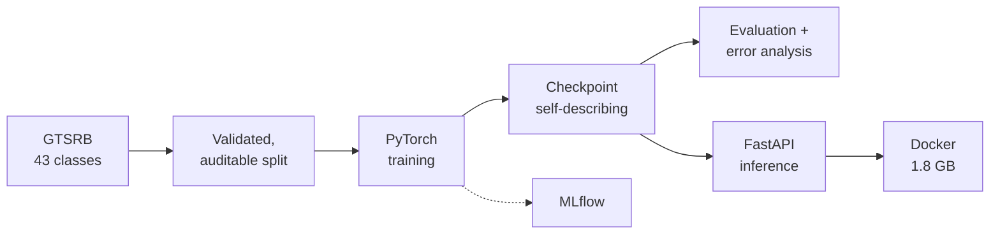
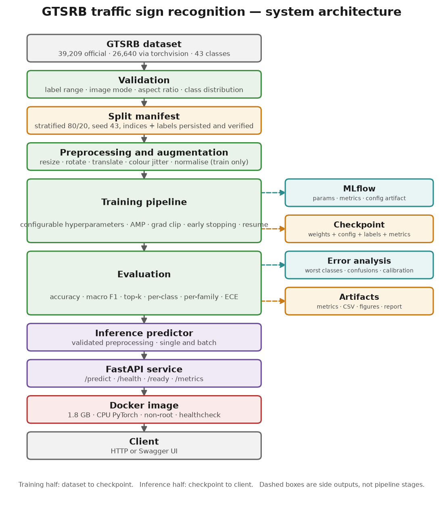
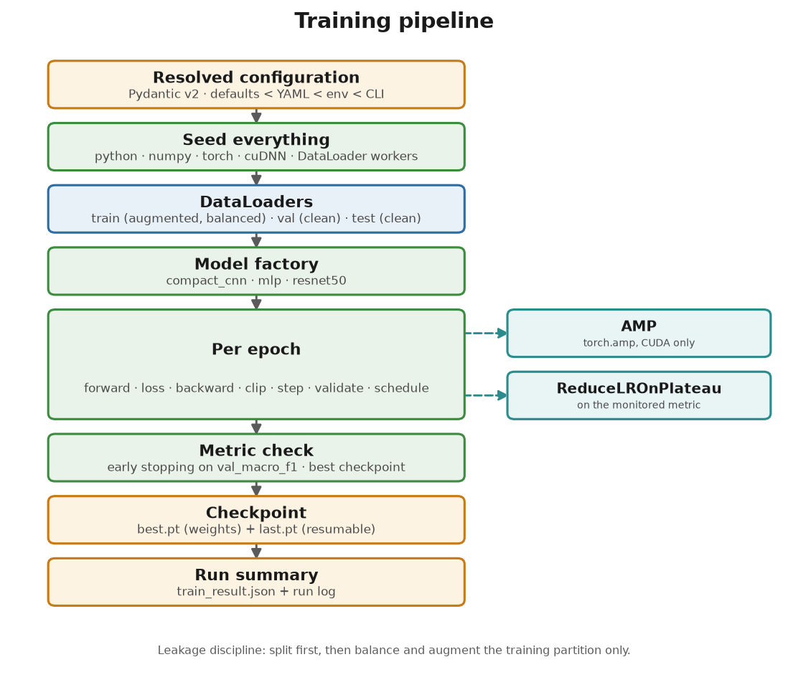
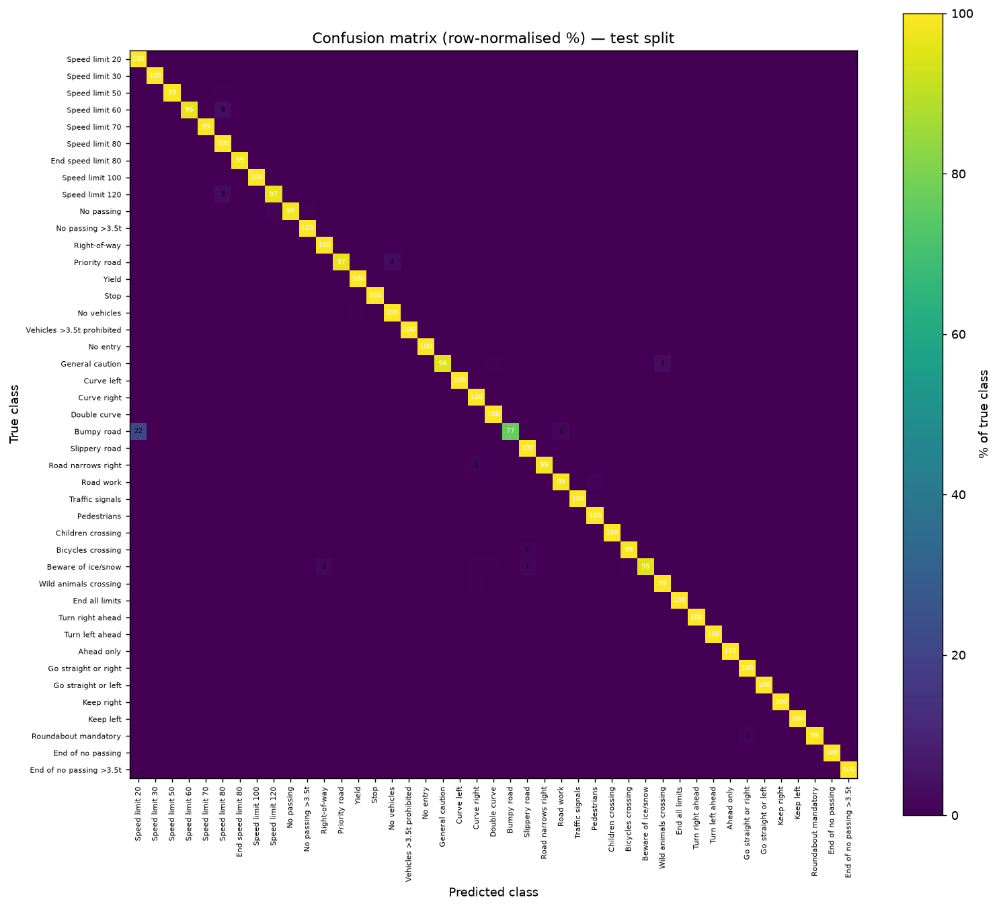
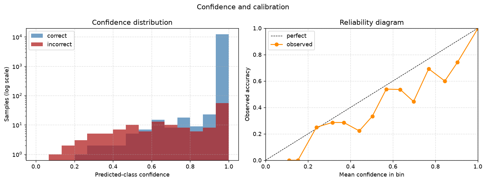
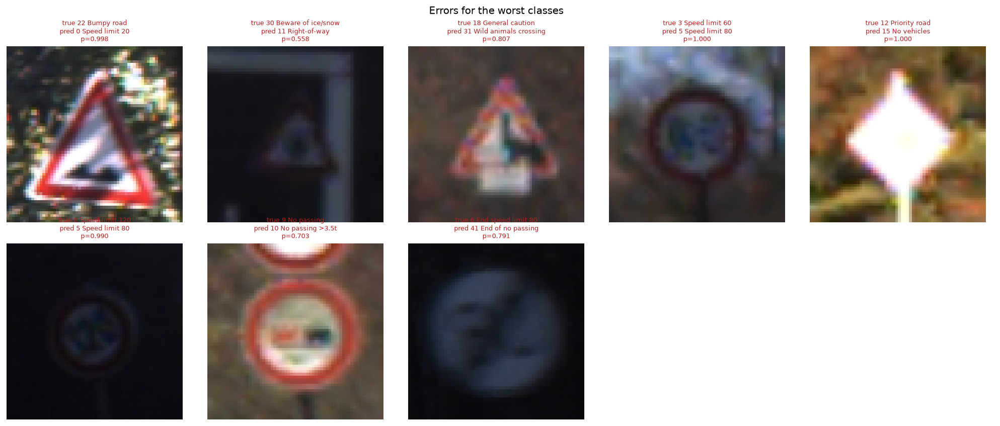
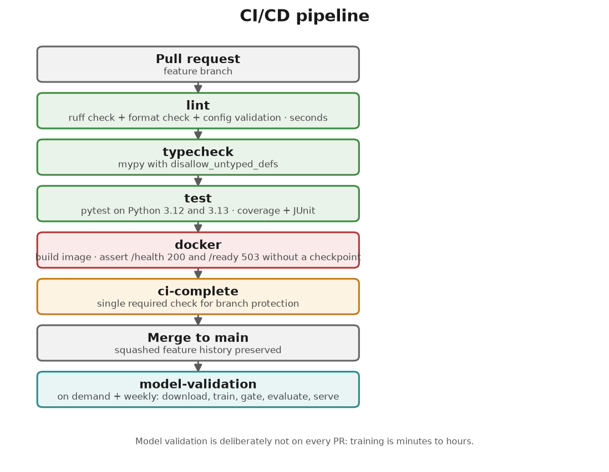
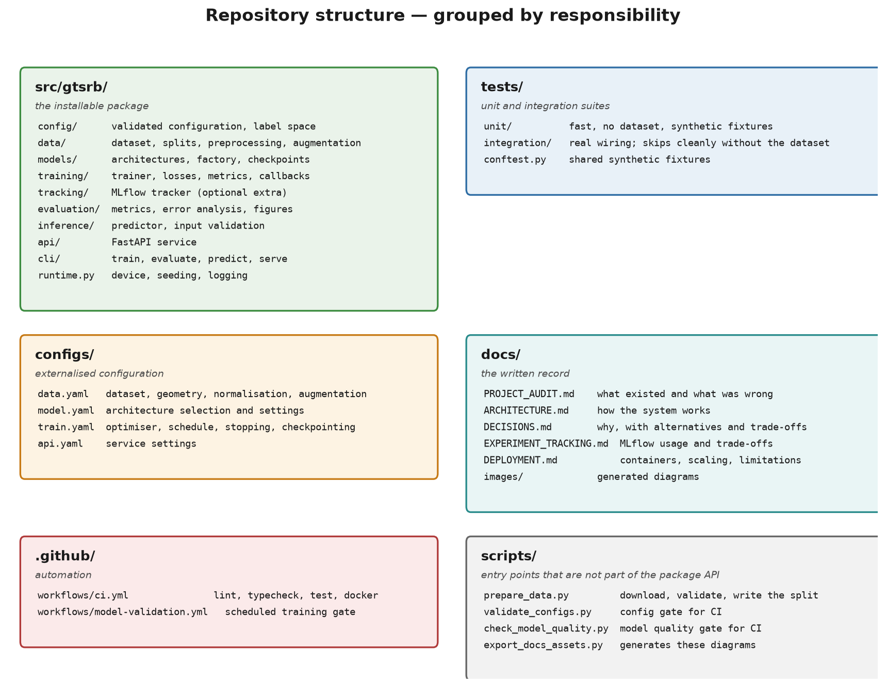

<div align="center">

# Production-Ready Traffic Sign Recognition

**End-to-end computer vision system for 43-class German traffic sign classification (GTSRB) —
reproducible PyTorch training, an auditable data pipeline, MLflow experiment tracking,
structured error analysis, and a containerised FastAPI inference service.**

[](https://www.python.org/)
[](https://pytorch.org/)
[](https://fastapi.tiangolo.com/)
[](https://mlflow.org/)
[](Dockerfile)
[](../../actions/workflows/ci.yml)
[](https://docs.astral.sh/ruff/)
[](https://mypy-lang.org/)
[](tests/)
[](LICENSE)

</div>

---

## Overview

Traffic sign recognition is a safety-critical perception task: a misread sign becomes
a wrong driving decision. This project takes the 43-class GTSRB benchmark from a
university notebook to a deployed service, and treats the parts a notebook hides —
reproducible splits, calibrated confidence, and failures that are analysed rather
than counted — as the actual engineering problem.

Three things distinguish it from a "train a CNN, report accuracy" project:

**The evaluation does not stop at accuracy.** The recorded baseline reaches 98.84%
accuracy while getting one class — *Pedestrians* — right only **54%** of the time.
That is a real measurement from this project's own confusion matrix, digitised during
the [audit](docs/PROJECT_AUDIT.md), and it is why checkpoint selection, early stopping
and the entire error-analysis pipeline key on **macro F1** rather than accuracy. A
model that silently fails on one sign type is worse than one that is 2 points less
accurate overall.

**Every claim is measured.** A full 30-epoch run of this pipeline is reported
end to end — 98.90% accuracy, **0.9837 macro F1**, 0.0059 calibration error, 93.7 min
on an M1 — alongside the original run's numbers, which are labelled as such rather
than presented as new. Parameter counts, epoch timing, checkpoint sizes, container size
and inference latency are all measurements. Provenance:
[docs/RESULTS.md](docs/RESULTS.md).

**The serving path cannot drift from training.** Inference reads its input geometry
and normalisation statistics from the checkpoint, so a later config edit cannot
silently degrade predictions. That failure mode produces no error at all — just worse
answers — which is what makes it worth designing against.



---

## Key Features

| | |
| --- | --- |
| **Reproducible data pipeline** | Stratified split persisted as a manifest with indices *and* labels, verified on every load. Rejects a stale manifest, an overlapping split, or relabelled data. Reproduces the original 21,312/5,328 split exactly. |
| **Three architectures, one factory** | Compact CNN (default), ResNet-50 transfer learning, MLP baseline — the original controlled comparison, preserved. `build_model` is the only constructor, so training, evaluation and serving cannot diverge. |
| **Training loop** | Configurable hyperparameters, AMP, gradient clipping, four LR schedules, early stopping, resume-from-checkpoint, structured logging, and a tracker seam that keeps MLflow optional. |
| **Self-describing checkpoints** | Weights + resolved config + class labels + input geometry + normalisation + metrics + git commit. Inference needs nothing but the path, and serving cannot silently differ from training. |
| **Evaluation beyond accuracy** | Accuracy, top-3/top-5, macro and micro precision/recall/F1, per-class metrics, per-sign-family metrics, expected calibration error. |
| **Error analysis** | Worst classes by recall, confusions ranked by share of the true class, within- vs across-family errors, confident errors, rare-class error share — as JSON, CSV, Markdown and nine figures. |
| **Experiment tracking** | MLflow as an optional extra: params, per-epoch metrics, the resolved config as an artifact, and an opt-in model registry. Local SQLite by default — no server needed. |
| **Inference API** | FastAPI with `/predict`, `/health`, `/ready`, `/model-info`, `/metrics`. Documented error responses, no internal detail leaked, no uploaded image logged or persisted. |
| **Containerised** | 1.8 GB, two-stage, CPU-only PyTorch, non-root, read-only root filesystem, healthcheck. |
| **Tested and gated** | 455 tests at 92% coverage, none of which needs the dataset. Ruff, mypy, pre-commit, GitHub Actions on 3.12 and 3.13, plus a scheduled training-quality gate. |

---

## Architecture



The seam is the **checkpoint**: training produces it, inference consumes it. It is the
only interface between the two halves, and it is deliberately self-describing.

Full write-up, including the layering rules and the invariants each layer protects:
**[docs/ARCHITECTURE.md](docs/ARCHITECTURE.md)**

---

## ML Pipeline



```
raw GTSRB
   │
   ├─ validate      label range · image mode · aspect ratio · class distribution
   │
   ├─ split         stratified 80/20, seed 43   ← BEFORE any balancing or augmentation
   │                indices + labels persisted to a verified manifest
   │
   ├─ train part ──► augment (rotate · translate · colour) ──► WeightedRandomSampler
   │
   └─ val / test ──► resize + normalise only
```

The ordering **is** the leakage control: validation indices are chosen before any
balancing or augmentation happens, and the evaluation transform contains no
augmentation. No augmented view, and no resampled copy, of a validation image can
reach the training set.

Class balance uses `WeightedRandomSampler` with inverse-frequency weights instead of
materialising an oversampled index list — same balance, flat memory, a fresh draw of
minority classes each epoch. The achieved balance is **computed and logged**, not
assumed.

---

## Model

| Architecture | Parameters | Size in memory | Role |
| --- | ---: | ---: | --- |
| **`compact_cnn`** (default) | **9,557,483** | **36.5 MB** | 3 conv blocks at 64×64, trained from scratch |
| `resnet50` | 24,580,203 (16,036,907 trainable) | 94.0 MB | ImageNet-pretrained transfer learning at 224×224 |
| `mlp` | **27,940,907** | 106.6 MB | Fully-connected baseline |

Parameter counts are measured by `summarise_model`, not estimated.

**The MLP has three times the compact CNN's parameters and scores 33 accuracy points
lower.** That is the whole argument for the convolutional prior in one line:
parameter count is not the bottleneck here — inductive bias is.

### Why the compact CNN is the default

1. **It measured best** on this dataset: 98.84% against ResNet-50's 96.97%. The
   original report's explanation is specific and plausible — ResNet-50 was fine-tuned
   with only `layer4` unfrozen, and the ImageNet→cropped-sign domain gap is real.
2. **It is ~2.6× smaller to serve and ~12× lighter per inference**: 64×64 input
   rather than 224×224, 36.5 MB rather than 94.0 MB, and no dependency on ImageNet
   weights.
3. **It keeps the from-scratch result honest.** The interesting claim is that a
   task-specific compact network beat a much larger pretrained one. That only holds
   if the compact network is the one being served.

Full reasoning, including the trade-offs accepted:
[DECISIONS.md §2](docs/DECISIONS.md#2-keep-the-compact-cnn-as-the-default).

```bash
# The other two are one flag away:
make train-mlp        # baseline
make train-resnet     # transfer learning
```

---

## Dataset

**GTSRB** — German Traffic Sign Recognition Benchmark (Stallkamp et al., 2011).
43 classes, cropped RGB images, long-tailed.

| | |
| --- | --- |
| Training images used | **26,640** |
| Test images | **12,630** (the official test partition) |
| Classes | 43 |
| Per-class range | 150 – 1500 (**10× imbalance**) |
| Train / validation split | 21,312 / 5,328 |

> ### ⚠️ A caveat that has to travel with every number here
>
> `torchvision`'s GTSRB `train` split contains **26,640** images. The official GTSRB
> training partition contains **39,209**.
>
> This project trains on 26,640 and evaluates on the official 12,630-image test
> split. **It is therefore not a full-GTSRB benchmark**, and its numbers are not
> directly comparable with papers that train on all 39,209. Re-verified during the
> refactor by downloading the dataset and reading `len(dataset)` for both splits.

The dataset is **never committed**. Download and prepare it with:

```bash
make data          # download, validate, and write the split manifest
make data-stats    # also re-measure the normalisation statistics
```

Normalisation uses GTSRB channel statistics (`mean=[0.3403, 0.3121, 0.3214]`,
`std=[0.2724, 0.2608, 0.2669]`). These were re-measured from the data during the
refactor: the configured mean matches a mean-of-per-image-means estimator to within
**0.002** and the std matches the pooled estimator to within **0.002**, so the
provenance of the original constants is now documented rather than assumed. The
constants were deliberately left unchanged to preserve comparability.

---

## Training

```bash
make train                    # compact CNN, 30 epochs, configs/*.yaml
make train-mlp                # MLP baseline
make train-resnet             # ResNet-50 transfer learning
make smoke                    # one epoch, to check the pipeline end to end
make train-tracked            # with MLflow tracking and model registration
```

Any config value is overridable from the command line:

```bash
python -m gtsrb.cli.train \
  --set training.epochs=15 \
  --set training.optimizer.lr=5e-4 \
  --set training.scheduler.name=cosine \
  --set data.augmentation.random_erasing_p=0.25
```

Precedence is explicit: **schema defaults → YAML → `GTSRB_*` environment → `--set`**.
A run's fully resolved config is written into the checkpoint and logged as an MLflow
artifact, so "which flags did we use?" is answerable after the fact.

### Two deliberate changes from the original protocol

- **Checkpoint and early-stopping monitor is `val_macro_f1`, not `val_accuracy`** —
  because accuracy hid a class at 54% recall.
- **`best.pt` carries no optimiser state.** Adam keeps two moment buffers per
  parameter, so a resumable checkpoint is ~3× the weights it contains. Measured:
  **114 MB for a 36.5 MB model**. The served artifact never needs it; `last.pt`
  remains fully resumable.

### Cost, measured

On the verification machine (Apple M1, 8 GB, MPS backend, `num_workers=0`):
**~130 s per epoch**, so the default 30-epoch run is about **65 minutes**.

---

## Experiment Tracking

MLflow is **optional and off by default** — the project trains, evaluates and serves
with no MLflow installed and no network access.

```bash
make install-all                                 # adds the tracking extra
python -m gtsrb.cli.train --set tracking.enabled=true
make mlflow-ui                                   # http://127.0.0.1:5000
```

Recorded per run: every scalar in the resolved config, the data pipeline's split sizes
and balance power, per-epoch metrics (train/val loss, accuracy, macro
precision/recall/F1, top-3, learning rate), the **resolved config as an artifact**, the
best checkpoint, and the model with an inferred signature. Registration is **opt-in**:
a registry entry is a claim that a model is worth promoting.

> **Two current-version constraints had to be worked around, both found by testing:**
>
> 1. MLflow 3.x put the filesystem tracking backend into maintenance mode and *raises*
>    on `file:./mlruns`. The default is now `sqlite:///mlflow.db` — still one local
>    file, no server, but on a supported backend.
> 2. The default `pt2` traced-graph serialisation accepts only the batch size it was
>    traced with (a model logged from batch 1 rejects batch 2 with
>    `Guard failed: x.size()[0] == 1`) and raises `NotImplementedError` on `.eval()`.
>    Models are logged with `pickle` instead.
>
> Both are written up in [docs/EXPERIMENT_TRACKING.md](docs/EXPERIMENT_TRACKING.md).

---

## Evaluation

### A real run of this repository — measured end to end

A complete 30-epoch run of **this** pipeline (`make train` → `make evaluate`), on the
M1, evaluated on the official 12,630-image test split:

| Metric | Value |
| --- | ---: |
| **Accuracy** | **98.90%** |
| **Macro F1** | **0.9837** |
| Macro precision / recall | 0.9822 / 0.9878 |
| Top-3 / top-5 accuracy | 0.9967 / 0.9979 |
| **Expected calibration error** | **0.0059** |
| Mean confidence when correct / incorrect | 0.998 / 0.749 |
| Errors | **139 / 12,630** |
| Best validation epoch | 26 (val accuracy 0.9992, val macro F1 0.9990) |
| Wall clock, 30 epochs | 93.7 min (M1 MPS; hosts were also under test load) |

**Class 27 (Pedestrians) — the original run's worst class at 54.2% recall — is at
100% recall on this run.** The largest residual failure is class 22 (Bumpy road) at
76.7%, and the honest caveat is in [RESULTS.md](docs/RESULTS.md#the-honest-caveat-on-class-22):
with 120 test samples, a few corrupted captures move the number materially, and the
gallery shows the dominant cause of *all* remaining errors is degraded capture —
motion blur, under-exposure, blown highlights — rather than model capacity.

Full record, including the reproduce-it-yourself checklist:
**[docs/RESULTS.md](docs/RESULTS.md)**

| Confusion matrix | Calibration |
| --- | --- |
|  |  |

### The original three-way comparison

These are the **measured outputs of the original COMP9444 notebook run** (Colab,
A100), preserved as provenance. They are **not** produced by this repository's
commands, they are single runs with no repeats, and the caveat below applies.

Test split, 12,630 images:

| Metric | Compact CNN | ResNet-50 | MLP baseline |
| --- | ---: | ---: | ---: |
| **Accuracy** | **98.84** | 96.97 | 65.84 |
| Precision (macro) | 98.32 | 95.14 | 64.90 |
| Recall (macro) | 97.99 | 96.71 | 65.22 |
| **F1 (macro)** | **97.98** | 95.79 | 63.50 |
| Precision (micro) | 98.84 | 96.97 | 65.84 |
| Recall (micro) | 98.84 | 96.97 | 65.84 |
| F1 (micro) | 98.84 | 96.97 | 65.84 |

### The number that matters more than accuracy

The macro-F1 gap tells the real story. Digitising the stored row-normalised confusion
matrix gives the CNN's per-class recall:

| True class | Predicted as | Share of true class |
| --- | --- | ---: |
| **27 Pedestrians** | **23 Slippery road** | **29.5%** |
| **27 Pedestrians** | **30 Beware of ice/snow** | **16.3%** |
| 6 End of speed limit 80 | 33 Turn right ahead | 4.9% |
| 12 Priority road | 15 No vehicles | 3.6% |
| 26 Traffic signals | 30 Beware of ice/snow | 2.4% |

**Class 27 (Pedestrians) sits at 54.2% recall. Every other class is at 91.7% or
above.** All three classes involved are red-bordered warning triangles with dark
pictograms — a genuinely hard, fine-grained discrimination, and exactly the kind of
failure a single accuracy number hides.

| Worst classes by recall | Recall | Support |
| --- | ---: | ---: |
| 27 Pedestrians | **54.2%** | 120 |
| 6 End of speed limit 80 | 91.7% | 360 |
| 12 Priority road | 96.4% | 1410 |
| 22 Bumpy road | 97.6% | 330 |
| 26 Traffic signals | 97.6% | 540 |

### Errors from the refactored run

Every image below is the model's **most confident** error for one of the worst classes.
Motion blur, under-exposure, blown highlights and one corrupted capture — degraded
input, not missing capacity.



The original run's recorded artifacts are kept as provenance in
[`docs/images/`](docs/images/) (`confusion_matrix_cnn.png`, `curves_cnn_loss.png`,
`misclassified_examples_cnn.png`).

### What the evaluation produces now

`make evaluate` writes a complete, reproducible artifact set per model:

```
artifacts/evaluation/<model>/
├── metrics.json              scalars, per-class and per-family tables
├── per_class.csv             precision / recall / F1 / support
├── per_category.csv          aggregated by sign family
├── confusion_matrix.{npy,csv}
├── category_confusion.csv    family-vs-family errors
├── top_confusions.csv        ranked by share of the true class
├── error_analysis.json       structured analysis
├── error_analysis.md         the same, as a written report
├── predictions.csv           per-sample prediction + confidence (12,630 rows)
└── figures/                  nine figures
```

Metrics go beyond accuracy: top-3/top-5, macro and micro P/R/F1, per-class,
per-sign-family, and **expected calibration error**. Error analysis reports worst
classes by recall, confusions ranked by *share of the true class* (so a rare class's
failure is not buried by a common one's), the within- vs across-family error split,
confident errors, and rare-class error share.

`predictions.csv` is the full per-sample record, so the analysis can be redone or
extended without a GPU — there is a test that rebuilds the confusion matrix from it and
asserts it matches.

---

## Inference API

```bash
make serve                    # http://127.0.0.1:8000
```

| Endpoint | Purpose |
| --- | --- |
| `POST /predict` | Classify one uploaded image |
| `GET /health` | Liveness — independent of the model |
| `GET /ready` | Readiness — 200 once the model is loaded and warmed, 503 otherwise |
| `GET /model-info` | Which model is deployed, and how good it was |
| `GET /metrics` | Prometheus exposition |
| `GET /docs` | Swagger UI |

### Real transcript

Captured against the containerised service with a trained checkpoint:

```console
$ curl -s localhost:8000/health
{"status":"ok","uptime_seconds":15.754,"version":"1.0.0"}

$ curl -s localhost:8000/ready
{"status":"ready","model_loaded":true,"model_name":"compact_cnn","device":"cpu",
 "checkpoint":"/app/artifacts/checkpoints/best.pt"}

$ curl -s -X POST localhost:8000/predict -F "file=@sign.png"
{
  "class_id": 14,
  "class_name": "Stop",
  "family": "priority",
  "confidence": 0.998413,
  "top_predictions": [
    {"class_id": 14, "class_name": "Stop",     "family": "priority",    "confidence": 0.998413},
    {"class_id": 17, "class_name": "No entry", "family": "prohibition", "confidence": 0.001021},
    {"class_id": 13, "class_name": "Yield",    "family": "priority",    "confidence": 0.000204}
  ],
  "latency_ms": 113.865,
  "model_name": "compact_cnn",
  "model_version": "epoch-8",
  "original_size": [64, 64]
}

$ curl -s -X POST localhost:8000/predict -F "file=@/etc/hosts"
{"error":"invalid_image",
 "detail":"Could not decode image: cannot identify image file",
 "request_id":"fa78d104-8f9b-4058-9606-baace2e8a734"}
```

### Design decisions worth noting

- **`/health` and `/ready` are separate.** A liveness probe that fails when the model is
  missing makes an orchestrator restart a healthy process forever. Readiness returns
  **503, not 500**, so a caller retries rather than assuming a bad request.
- **A failed model load does not stop startup.** `/health` stays 200 and `/ready`
  reports the reason. Crashing would produce a restart loop with no diagnosable
  endpoint.
- **Every error has the same shape** — a stable `error` code, a safe `detail`, and a
  `request_id`. No stack trace, file path or library message reaches a client.
- **Uploads are validated by decoding**, never by trusting a filename or
  `Content-Type`, and are never written to disk or logged.
- **Every documented command works.** The transcript above is real output, not an
  illustration.

---

## Local Setup

Requires **Python 3.12+** and [`uv`](https://docs.astral.sh/uv/).

```bash
git clone git@github.com:irajput215/GTSRB-Traffic-Sign-Recognition-Deep-Learning-Project-.git
cd GTSRB-Traffic-Sign-Recognition-Deep-Learning-Project-

make install            # dev tooling
make install-all        # plus MLflow and FastAPI extras

make data               # download GTSRB, validate, write the split manifest
make train              # ~65 min on an M1
make evaluate           # metrics, error analysis, figures
make serve              # FastAPI on :8000
```

### Everything you might want to run

| I want to… | Command |
| --- | --- |
| install | `make install` / `make install-all` |
| get the dataset | `make data` |
| check the normalisation statistics | `make data-stats` |
| train | `make train` / `make train-mlp` / `make train-resnet` |
| train quickly | `make smoke` |
| train with tracking | `make train-tracked` |
| view MLflow | `make mlflow-ui` |
| evaluate | `make evaluate` / `make evaluate-val` |
| predict one image | `make predict IMAGE=sign.png` |
| run the API | `make serve` |
| run the API in Docker | `make docker-up` |
| run the tests | `make test` |
| lint / format / typecheck | `make lint` / `make format` / `make typecheck` |
| run everything CI runs | `make ci` |
| see the resolved config | `make config` |
| regenerate the diagrams | `uv run python scripts/export_docs_assets.py` |

`make` or `make help` lists them all.

**Reproducibility details, including the limits of it:**
[docs/REPRODUCIBILITY.md](docs/REPRODUCIBILITY.md)

---

## Docker

```bash
make docker-build
make docker-up          # waits for readiness, then http://127.0.0.1:8000
```

Or directly:

```bash
docker build -t gtsrb-traffic-sign-recognition:local .
docker run --rm -p 8000:8000 \
  -v "$PWD/artifacts/checkpoints:/app/artifacts/checkpoints:ro" \
  -e GTSRB_CHECKPOINT_PATH=/app/artifacts/checkpoints/best.pt \
  gtsrb-traffic-sign-recognition:local
```

### Image size, measured

| Configuration | Size |
| --- | ---: |
| Default PyPI `torch` (the CUDA build) | **9.63 GB** |
| CPU `torch` from the PyTorch CPU index | 1.90 GB |
| CPU `torch` + removing an unused dependency | **1.80 GB** |

On Linux, PyPI's `torch` **is** the CUDA build — 3.3 GB of `nvidia` runtime libraries
plus 817 MB of `triton` for a service that runs on CPU.

Fixing that took two attempts, and the first one failing is the interesting part:
setting `UV_INDEX_URL` in the Dockerfile had **no effect**, because the *lock file*,
not the index URL, decides what `uv sync --frozen` installs. The index is declared in
`pyproject.toml` instead, so the lock itself is CPU-only. Full story in
[DECISIONS.md §13](docs/DECISIONS.md#13-docker-with-cpu-only-pytorch).

**Deployment details, scaling and honest limitations:**
[docs/DEPLOYMENT.md](docs/DEPLOYMENT.md) — including the ones that are deliberate: no
authentication, no rate limiting, no drift alerting.

---

## Testing

```bash
make test              # everything
make test-unit         # fast, no dataset
make test-integration  # real wiring
make coverage
```

**455 tests at 92% coverage, and none of them requires the GTSRB download.** Fixtures build synthetic
sign-like images and tiny models, so the suite runs on a fresh clone in seconds. Tests
that genuinely need the real data skip cleanly when it is absent — the same command
works on a laptop, in CI and on a fresh clone.

| Suite | Covers |
| --- | --- |
| `unit/test_config.py` | merge semantics, override parsing, every schema validator, label-space integrity, shipped YAML |
| `unit/test_data.py` | transforms (including the no-flip guarantee), `TransformSubset`, split determinism and stratification, **every manifest failure mode**, class weights, loader wiring |
| `unit/test_models.py` | all three architectures, freezing policy, factory guards, checkpoint round-trip, **every rejection path** |
| `unit/test_training.py` | metric accumulation, confusion counts, calibration, early stopping, checkpoint selection, all four schedules, full trainer runs (fit, resume, early stop, non-finite loss) |
| `unit/test_evaluation.py` | every metric, family collapse, confusion ranking, worst classes, all nine figures, the full evaluation run |
| `unit/test_inference.py` | preprocessing, validation (small / large / truncated / bomb / non-image), predictor setup, batch equals single |
| `unit/test_scripts.py` | both CI gates, including that a missing or malformed input **fails** rather than passes |
| `integration/test_data_pipeline.py` | **the real GTSRB split reproducing 21,312 / 5,328** |
| `integration/test_mlflow_tracking.py` | a real MLflow SQLite store: run lifecycle, artifact logging, model round-trip, registry |
| `integration/test_api.py` | the real FastAPI app: every endpoint, every error path, OpenAPI completeness |

Writing the integration tests paid for itself: it surfaced a bug where reading labels
through `__getitem__` decoded all 26,640 images, because torchvision's GTSRB decodes
the PNM before returning the label. Fixing it took the suite **from 216 s to 8 s**.

---

## CI/CD



| Job | What it does | Why separate |
| --- | --- | --- |
| `lint` | ruff check + format check + config validation | **No project dependencies** — finishes in seconds, gives feedback before torch is installed |
| `typecheck` | mypy with `disallow_untyped_defs` | Needs the project importable |
| `test` | pytest on Python **3.12 and 3.13**, coverage + JUnit | |
| `docker` | Builds the image, asserts `/health` 200 while `/ready` is 503 with no checkpoint | A Dockerfile that no longer builds is a broken deployment no unit test catches |
| `ci-complete` | Single required check | Adding a matrix entry later does not mean editing branch protection |

**Model validation is deliberately not on every PR** — training is minutes to hours,
and gating a PR on it would make CI useless. A separate workflow runs on demand and
weekly: download GTSRB → train → assert a quality floor → evaluate → **serve a real
prediction** from the produced checkpoint.

```bash
make ci        # mirrors the workflow locally, including hooks and coverage
```

Every documented command in this repository was executed. `make check` and `make ci`
both pass.

---

## Project Structure



```
src/gtsrb/
├── config/      validated configuration, label space
├── data/        dataset, splits, preprocessing, augmentation, validation
├── models/      architectures, factory, checkpoint contract
├── training/    trainer, losses, metrics, callbacks
├── tracking/    tracker protocol, NullTracker, MLflow implementation
├── evaluation/  metrics, error analysis, figures, runner
├── inference/   predictor, input validation
├── api/         FastAPI app, routes, schemas, dependencies, observability
├── cli/         train, evaluate, predict, serve
└── runtime.py   device, seeding, logging
```

Two deliberate deviations from the conventional layout:

- **Entry points live in `src/gtsrb/cli/`, not `scripts/`.** A console script is
  importable, testable and installable; a loose script that only works from the repo
  root is none of those. `scripts/` holds only the four things that genuinely are not
  part of the package interface.
- **No `common/` or `utils/`.** Shared code is in `gtsrb/runtime.py`, which names what
  it contains rather than only "miscellaneous".

---

## Engineering Decisions

Twenty decision records, each with the alternatives considered and the trade-off
accepted: **[docs/DECISIONS.md](docs/DECISIONS.md)**

| # | Decision |
| --- | --- |
| 1–3 | PyTorch over TensorFlow · keep the compact CNN as default · keep the MLP baseline |
| 4–5 | Weighted sampling over materialised oversampling · select on macro F1, not accuracy |
| 6–7 | Pydantic v2 + YAML configuration · persist **and verify** the data split |
| 8–10 | MLflow and only MLflow · SQLite backend (reversed after measuring) · `pickle` artifacts (reversed after measuring) |
| 11–13 | FastAPI · Pillow not OpenCV · Docker with CPU-only PyTorch (**9.63 GB → 1.8 GB**) |
| 14–17 | No Kubernetes · CLIs in the package · code-generated diagrams · self-describing checkpoints |
| 18–20 | Reported metrics stay the original run's · no test requires the dataset · separate model-validation workflow |

Three of these reversed a first implementation after a measurement, and the reversals
are kept in the record — the first answer being wrong is more informative than a tidy
list of correct ones.

Also: **[docs/RESULTS.md](docs/RESULTS.md)** — both runs, the comparison, the full
per-class table and an explicit list of what the results do **not** show.
**[docs/PROJECT_AUDIT.md](docs/PROJECT_AUDIT.md)** — the evidence-based audit of what
existed before any of this, including 25 concrete problems and three places where the
original report and the original code disagreed.

---

## Future Improvements

Ordered by expected value, with the reasoning and the reason it is not done:

1. **Full-GTSRB training and a proper benchmark.** Train on the official 39,209-image
   partition and report all three architectures with multiple seeds and confidence
   intervals. The current numbers are a single run each. *Not done:* several GPU-hours
   for the three-way comparison, and the current numbers are honestly labelled.
2. **Fix class 27.** It is the clear failure at 54% recall. The targeted fix is more
   warning-triangle augmentation plus higher input resolution for that family, both
   measurable against the existing per-class baseline.
3. **Better transfer learning.** The report's own future work: gradual unfreezing,
   discriminative learning rates, cosine decay with warm-up. The config already
   supports `trainable_blocks=("layer3","layer4")` and a cosine schedule, so this is a
   set of experiments rather than a rewrite.
4. **Test-time augmentation and calibration.** TTA for a small accuracy gain;
   temperature scaling to reduce the calibration error the evaluation now measures.
   Calibration matters more than accuracy for a safety-facing confidence score.
5. **A detection stage.** This project classifies cropped signs. A real system needs
   detection and tracking first — a lightweight YOLO variant before the classifier.
6. **Drift monitoring with alerting.** `gtsrb_predictions_total` already exposes the
   predicted-class distribution, which is the raw signal; nothing alerts on it.
7. **Batch inference endpoint.** `predict_batch` already does one forward pass for a
   batch; a small request queue in front of it would use more of each core.
8. **Shrink the image by ~210 MB** by moving `scikit-learn`, `matplotlib` and `scipy`
   into a `[train]` extra. Noted rather than done, because it changes what a bare
   `pip install` provides for a 12% reduction.

---

## Lessons Learned

**A single accuracy number can hide a broken model.** 98.84% accuracy alongside 54%
recall on *Pedestrians* — one sign type the model effectively had not learned. It was
invisible in the headline metric and obvious the moment the confusion matrix was read
row by row. Every decision downstream of that — macro-F1 selection, per-class
reporting, the error-analysis pipeline — exists because of it.

**The failure modes that matter produce no error.** Wrong normalisation statistics, a
stale split manifest, a config that drifted from the checkpoint: each yields a model
that runs perfectly and answers worse. Those are the ones worth designing against,
which is why the checkpoint carries its own preprocessing contract and the split
manifest is verified on every load.

**Reproducibility is a chain, and it breaks at the weakest link.** Seeds in Python,
NumPy and torch are not enough — DataLoader workers have their own RNG, and
augmentation happens inside them. The original run seeded three of the four. The lock
file overrides a build-time index URL. The generator passed to a sampler is separate
from the global one. Each link has to be found and pinned deliberately.

**"I configured it" is not the same as "it took effect."** The CPU-torch fix looked
correct and produced an identical 9.63 GB image, because the lock file — not the index
URL — decided what got installed. The only reason it was caught is that the image size
was measured rather than assumed. The same pattern showed up in `torch.topk`'s return
order and in macro-averaging without an explicit label space: each looked right, each
was silently wrong, and each was caught by an assertion rather than by reading the
code.

**Tests pay for themselves in places you do not expect.** The integration tests were
written to check the data pipeline. They surfaced a performance bug — reading labels
decoded all 26,640 images — that took the suite from 216 s to 8 s, and a check that
the top-43 confidences sum to 1 that caught a swapped `topk` unpacking. Neither was
the thing being tested.

**Honest scoping reads better than an impressive stack.** No Kubernetes, no cloud
platform, no second tracking framework — each was considered and rejected with a
reason, and the rejections are written down. The project is one stateless container
serving one API, and saying so is more defensible than adding infrastructure that
would never be exercised.

---

## Author

**Ishu Rajput**

Originally a four-person COMP9444 (Neural Networks and Deep Learning) group project at
the University of Sydney with Ashwin Sudhir Jamgade, Shashwat Pasari and Xiangyu Dou.
The original notebook, report and presentation are preserved under `legacy/` and
`docs/original/`, and the original commit remains in the git history.

This repository is the engineering refactor of that work: the analysis is the group's;
the production architecture, tests, service and documentation are mine.

**Licence:** MIT — see [LICENSE](LICENSE).
The GTSRB dataset is distributed separately and is not included in this repository.
