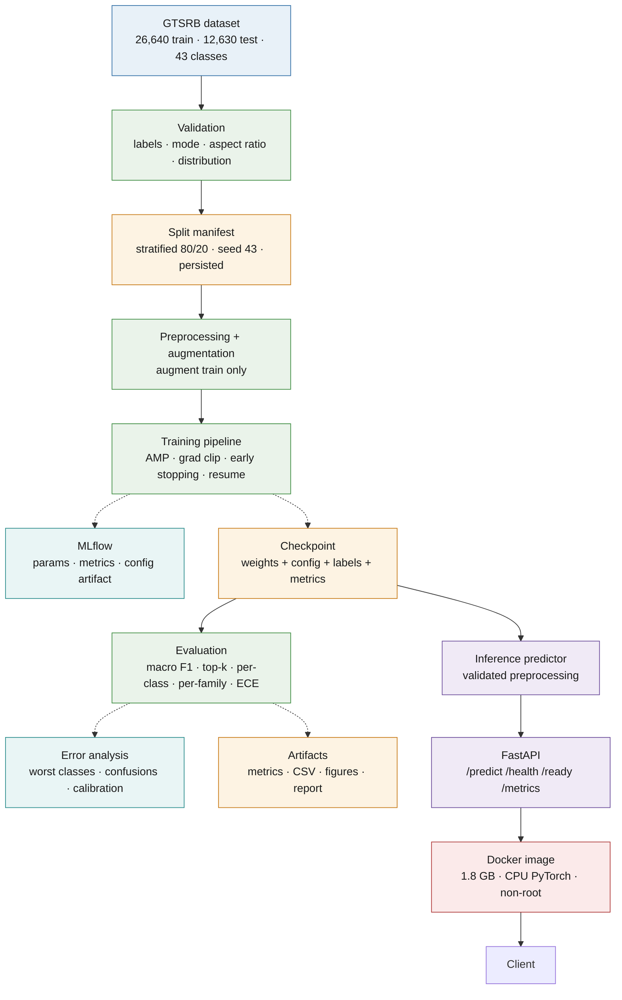
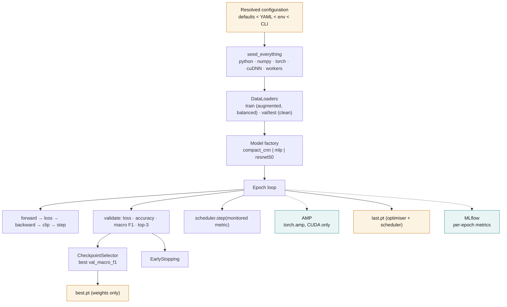
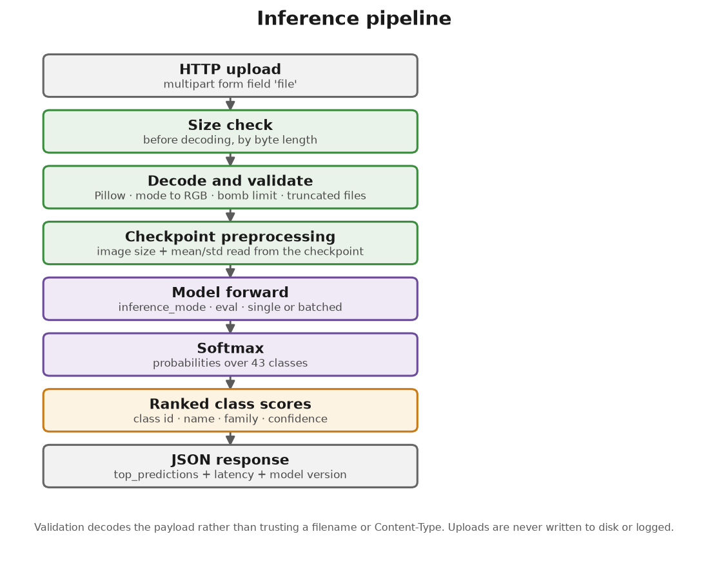
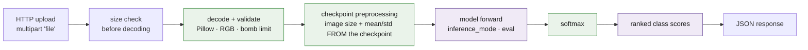
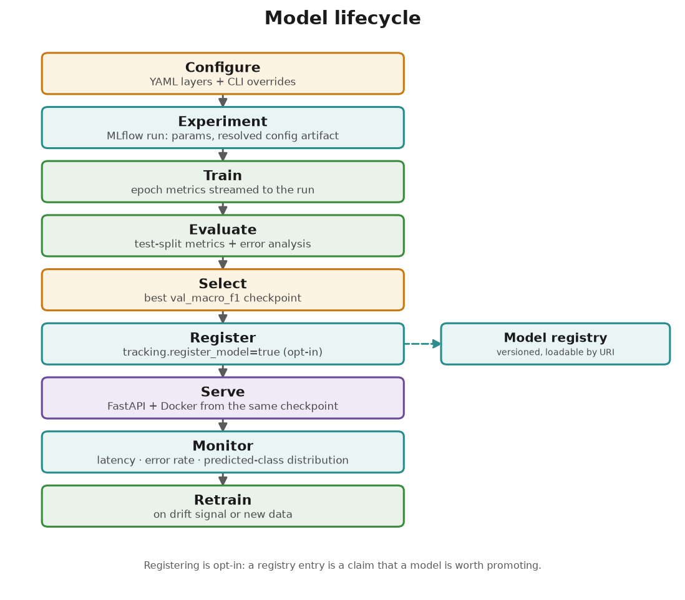
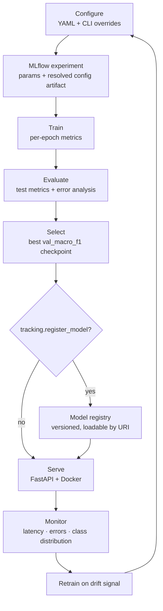
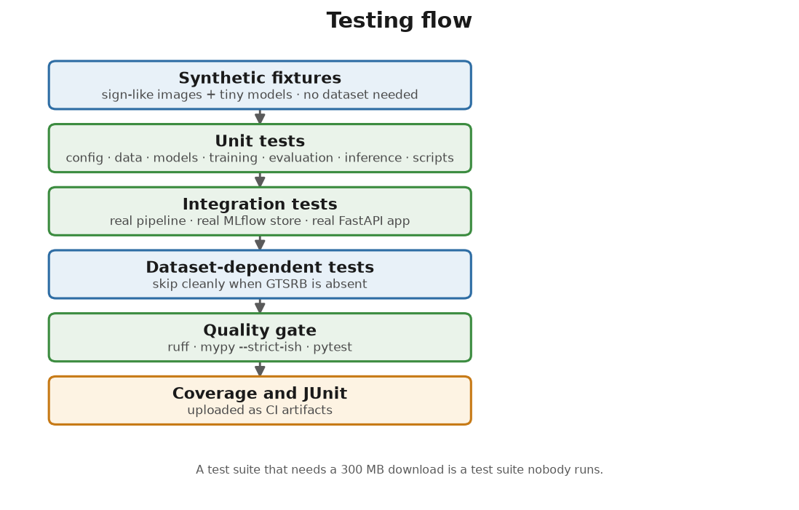
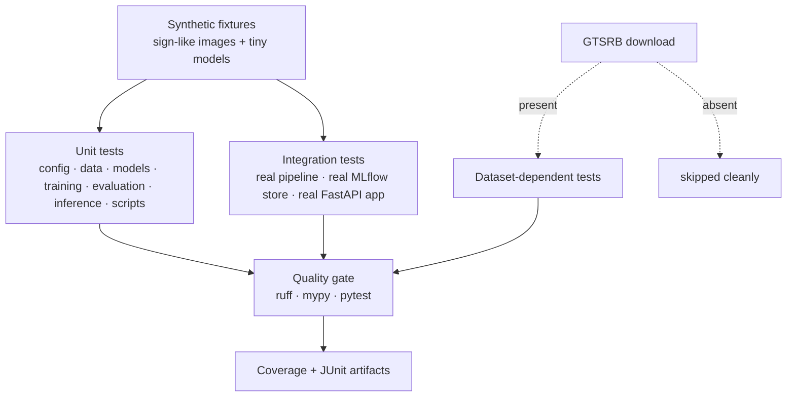
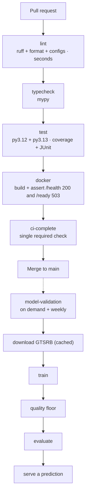

# Architecture

How the system is put together, why it is split the way it is, and what the
invariants are that keep it correct.

Every diagram below exists in two forms: **Mermaid** (maintainable, diffable, and
rendered by GitHub) and a generated **PNG** under `docs/images/` produced by
`scripts/export_docs_assets.py`. The Mermaid is the source of truth for the flows;
the PNGs are what make the README readable without a renderer.

---

## 1. System overview

Two halves that meet at one artifact — the checkpoint.




**The seam is the checkpoint.** Training produces it; inference consumes it. It is
the only interface between the two halves, and it is deliberately self-describing
— see §5.

---

## 2. Layering

The package is layered so that each stage can be used, tested and reasoned about on
its own. The dependency direction is one-way and enforced by review, not by tooling:

```
config  ←  data  ←  training  ←  evaluation
   ↑         ↑         ↑
 models  ←───┴─────────┴──────  inference  ←  api
runtime  (used by everything; depends on nothing but config types)
```

| Layer | Depends on | Never depends on |
| --- | --- | --- |
| `gtsrb.config` | — | everything |
| `gtsrb.runtime` | `config` types | anything else |
| `gtsrb.data` | `config`, `runtime` | models, training, evaluation |
| `gtsrb.models` | `config` | data, training |
| `gtsrb.training` | `config`, `data`, `models`, `tracking` | evaluation, api |
| `gtsrb.tracking` | `config` | training internals (it is called *by* the trainer through a protocol) |
| `gtsrb.evaluation` | `config`, `data`, `models`, `training.metrics` | api |
| `gtsrb.inference` | `config`, `models`, `data.preprocessing` | training, evaluation, api |
| `gtsrb.api` | `config`, `inference` | data, training, evaluation |

Two rules that matter in practice:

1. **`gtsrb.inference` does not import `gtsrb.training`.** It imports
   `gtsrb.data.preprocessing` for the transform builder — the same function
   evaluation uses — but nothing from the training loop. That is what keeps the
   serving image free of training concerns.
2. **`gtsrb.api` does not import `gtsrb.data`.** The API never builds a dataset.
   It needs the image transform, which `inference` already provides.

---

## 3. Training-time architecture




### Configuration precedence

```
schema defaults  →  configs/*.yaml (in order)  →  GTSRB_* environment  →  --set key=value
```

It is explicit because the alternative is a run whose log says 30 epochs while a
shell profile silently forced 5. `ProjectConfig` is a frozen Pydantic v2 model that
rejects unknown keys, so a typo fails at startup rather than training the wrong
thing. The fully resolved config is written into the checkpoint and logged to
MLflow as an artifact, which is what makes a run reproducible after the fact.

### The training loop

`Trainer.fit()` runs, per epoch:

1. seed-independent forward/backward with AMP when the device supports it;
2. gradient clipping — after `scaler.unscale_`, because clipping scaled gradients
   applies the threshold to the wrong magnitudes;
3. validation under `torch.no_grad()`;
4. `scheduler.step(monitored metric)` for plateau schedules, `step()` otherwise;
5. `last.pt` written **every** epoch, `best.pt` only on improvement;
6. early stopping when the monitored metric stops improving.

Two behaviours that were changed from the original notebook, with reasons:

- **The monitor is `val_macro_f1`, not `val_accuracy`.** The audit showed the
  recorded CNN at 98.84% accuracy with class 27 (Pedestrians) at 54% recall.
  Selecting on accuracy selects a model that is not the best one for the long tail.
- **`best.pt` carries no optimiser state.** Adam keeps two moment buffers per
  parameter, so a resumable checkpoint is roughly three times the weights it
  contains — measured: 114 MB for a 36.5 MB model. The served artifact never needs
  that. `last.pt` remains fully resumable.

### Data flow and leakage

```
raw GTSRB
   │
   ├─ validate: label range, image mode, aspect ratio, class distribution
   │
   ├─ split   ← BEFORE any balancing or augmentation
   │     stratified 80/20, seed 43, indices + labels written to a manifest
   │
   ├─ train partition ──► augmentation ──► WeightedRandomSampler
   │
   └─ val / test partition ──► resize + normalise only
```

The ordering is the leakage control, and it is stated once so it can be checked.
No augmented view, and no resampled copy, of a validation image can reach the
training set, because the validation indices are chosen before either happens and
the evaluation pipeline contains no augmentation at all.

The split is **persisted and verified**, not recomputed from a seed and hoped to be
identical. `verify_manifest` rejects a manifest whose dataset length, seed, or
validation fraction has changed, whose indices overlap or fail to cover the
dataset, or whose per-index labels no longer match. That last case is the failure
mode a persisted split introduces: same length, different labels, silent mis-split.

### Class balance

Weighted sampling rather than materialised oversampling:

```
weight(class) = count(class) ** -power        # power = 1.0 → fully balanced
```

Same balance, flat memory, a fresh draw of the minority classes each epoch instead
of one fixed repeated list, and a local `torch.Generator` instead of the global
NumPy RNG. The *effective* per-class draw counts are computed and logged, so the
balance actually achieved is verified rather than assumed.

---

## 4. Inference-time architecture





### The most important property

**Preprocessing parameters come from the checkpoint, not from configuration.**
Getting this wrong produces no error — just worse predictions — so the transform is
built from `metadata.image_size`, `metadata.normalize_mean` and
`metadata.normalize_std`, which are the values the model was trained with. A
checkpoint trained at 64×64 with GTSRB statistics is preprocessed at 64×64 with
GTSRB statistics even if `configs/data.yaml` has since changed. There is a test
asserting exactly this.

The builder itself is `gtsrb.data.preprocessing.build_eval_transform`, shared with
the evaluation pipeline, so training, evaluation and serving cannot drift.

### Validation policy

| Case | Behaviour | Why |
| --- | --- | --- |
| Payload over the byte limit | Reject before decoding | A 2 GB upload must not reach the decoder |
| Not an image | Reject by decoding | A filename and `Content-Type` are client-controlled |
| Greyscale / CMYK | Convert to RGB | A legitimate action with an unambiguous meaning |
| Below 8 px | Reject | Stretching a 3×3 image produces a confident, meaningless answer |
| Decompression bomb | Reject via an explicit pixel limit | Bounded memory |
| Truncated file | Reject | Pillow opens lazily and would half-decode |

### Concurrency model

`torch.inference_mode()` (stricter than `no_grad`: it also skips version-counter
bookkeeping, and makes accidental autograd an error rather than a silent slowdown).
`predict_batch` runs **one** forward pass for the whole batch — asserted by a test
that counts calls. A `warmup()` forward pass runs at startup so the first real
request is not the slow one.

---

## 5. The checkpoint contract

The single interface between training and serving.

```python
{
  "metadata": {
    "format_version": 1,              # rejects unreadable layouts
    "created_at": "...",
    "model_name": "compact_cnn",      # which architecture to rebuild
    "num_classes": 43,
    "class_names": [...],             # the exact label ordering
    "image_size": 64,                 # input geometry
    "normalize_mean": [...],          # preprocessing constants
    "normalize_std": [...],
    "config": {...},                  # full resolved config
    "metrics": {...},                 # validation metrics at this epoch
    "epoch": 28,
    "git_commit": "...",
    "library_versions": {...},
  },
  "model_state": {...},
  "optimizer_state": {...},           # last.pt only
  "scheduler_state": {...},           # last.pt only
  "extra": {"is_best": true, "resumable": false},
}
```

Why each field exists:

- **config** — serving rebuilds the architecture from the checkpoint, so the caller
  needs to know nothing about how it was trained. It also means the served model
  cannot silently differ from the evaluated one.
- **class_names** — a checkpoint with a permuted label space is rejected at load
  time rather than serving confidently wrong names. This is the only reason the
  field is stored.
- **image_size, normalize_*** — the preprocessing contract (§4).
- **format_version** — the field that lets this layout change later without a
  silent misread. It already caught nothing, but it will.
- **library_versions, git_commit** — provenance. The original notebook's
  `state_dict` had none of this, which is why reconstructing inference from it
  required the notebook.

Writes are atomic: the payload goes to a temporary file which then replaces the
target, so an interrupted save cannot destroy the previous best checkpoint.

---

## 6. Model lifecycle





Registration is **opt-in**: a registry entry is a claim that a model is worth
promoting, and that should be a deliberate act rather than a side effect of
training. Tracking itself is off by default and points at a local SQLite database,
so the whole lifecycle works with no server and no network. See
[EXPERIMENT_TRACKING.md](EXPERIMENT_TRACKING.md).

---

## 7. Testing flow





The organising constraint: **no test requires the GTSRB download.** Fixtures build
synthetic sign-like images and tiny models. A test suite that needs a 300 MB
download is a test suite nobody runs. Tests that genuinely need the real data are
marked and skip cleanly when it is absent, so the same command works on a laptop,
in CI and on a fresh clone.

Freezing the training config into the checkpoint and the checkpoint into inference
means the integration tests can exercise the real path — real middleware, real
error handlers, a real MLflow store — without training anything.

---

## 8. CI/CD flow




`lint` runs with **no project dependencies**, so it finishes in seconds and gives
style feedback before the test job has installed torch. The `docker` job starts the
container with **no checkpoint mounted** and asserts `/health` returns 200 while
`/ready` returns 503 — the behaviour that stops an orchestrator restart-looping a
healthy container, and the one regression a Dockerfile change could introduce.

Model validation is deliberately **not** on every PR: training is minutes to hours,
and gating a PR on it would make CI useless. It runs on demand and weekly, and
asserts a quality floor, so silent rot in the data pipeline or the dependency stack
is caught.

---

## 9. Invariants

The properties the architecture exists to guarantee. Each has a test.

| Invariant | Where it is enforced |
| --- | --- |
| Validation data is never augmented or resampled | Split precedes balancing; eval transform has no augmentation |
| The split is reproducible and auditable | Persisted manifest + `verify_manifest` |
| Serving preprocesses as training did | Checkpoint metadata drives the transform |
| Class labels have exactly one definition | `gtsrb.config.labels`, validated at checkpoint load |
| The served model is the evaluated model | `best.pt` is what evaluation loads |
| Errors never expose internals | One `error_payload` shape; tracebacks only in logs |
| Uploads are never persisted or logged | Validation in memory; logging records only service output |
| Every reported artifact exists | `evaluate_checkpoint` appends each path it writes |
| No training runs in CI | Separate workflow, not gated on PRs |

---

## 10. Repository layout


Two deviations from the conventional layout, both deliberate:

**Entry points live in `src/gtsrb/cli/`, not `scripts/`.** A console script that is
installed and importable (`gtsrb-train`, `gtsrb-evaluate`, …) is testable and
discoverable; a loose script that has to be run from the repository root is neither.
`scripts/` is reserved for things that genuinely are not part of the package
interface: dataset preparation, CI gates, and diagram generation.

**There is no `gtsrb/common/` or `gtsrb/utils/`.** Shared code went to
`gtsrb/runtime.py`, which has a name that says what it contains — device
resolution, seeding, logging — rather than a name that says only "miscellaneous".

```
src/gtsrb/
├── config/      validated configuration, label space
├── data/        dataset, splits, preprocessing, augmentation, validation
├── models/      architectures, factory, checkpoint contract
├── training/    trainer, losses, metrics, callbacks
├── tracking/    tracker protocol, NullTracker, MLflow implementation
├── evaluation/  metrics, error analysis, figures, runner
├── inference/   predictor, input validation
├── api/         FastAPI app, routes, schemas, dependencies, observability
├── cli/         train, evaluate, predict, serve
└── runtime.py   device, seeding, logging
```
