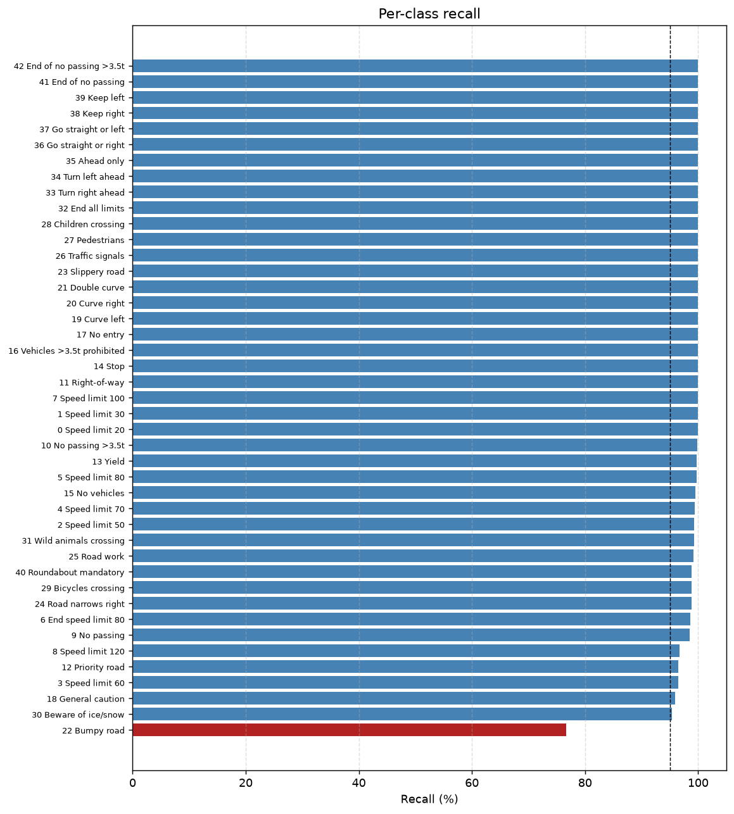
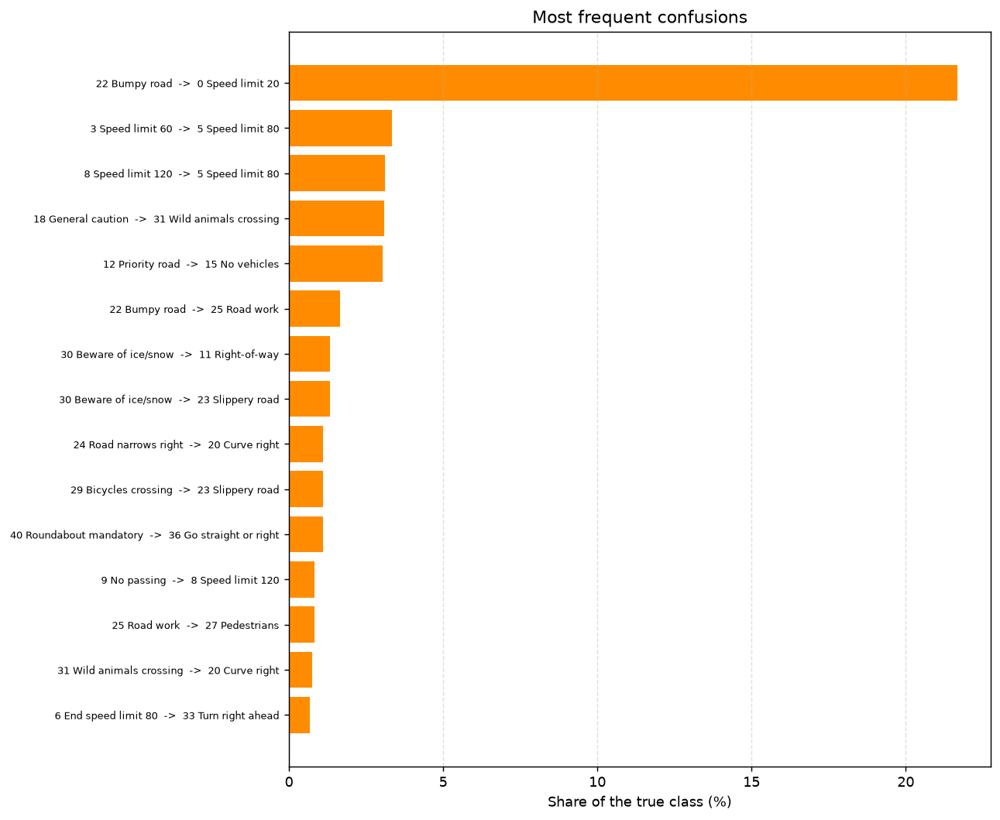
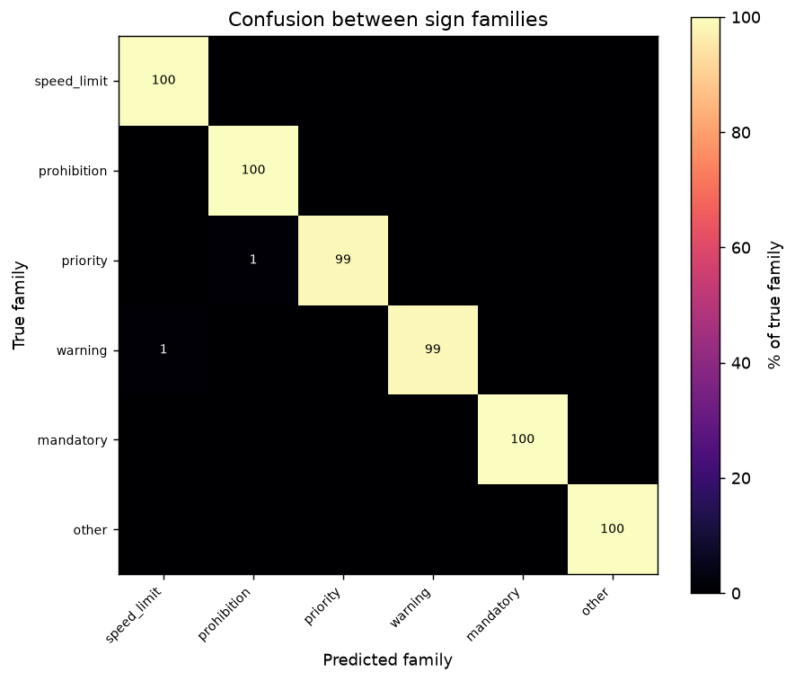
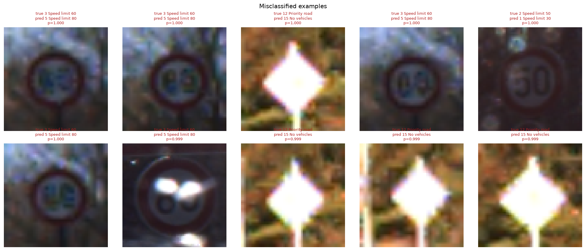

# Results

Two sets of numbers appear in this project, and they are not the same thing. This
document keeps them apart.

| | Source | Reproducible from this repo? |
| --- | --- | --- |
| **Original run** | The COMP9444 group notebook, Colab A100 | **No** — different code, different environment |
| **Refactored run** | This repository, `make train` + `make evaluate` | **Yes** — the exact config and checklist are below |

---

## 1. Original recorded run

Preserved from `legacy/COMP9444_notebook.ipynb`; written up in
`docs/original/COMP9444_report.pdf`. Environment: Google Colab, A100, Python 3.11.5,
unpinned library versions. **Single run each, no repeats, no confidence intervals.**

Test split, 12,630 images:

| Metric | Compact CNN | ResNet-50 | MLP baseline |
| --- | ---: | ---: | ---: |
| **Accuracy** | **98.84** | 96.97 | 65.84 |
| Precision (macro) | 98.32 | 95.14 | 64.90 |
| Recall (macro) | 97.99 | 96.71 | 65.22 |
| **F1 (macro)** | **97.98** | 95.79 | 63.50 |
| Precision (micro) | 98.84 | 96.97 | 65.84 |
| Recall (micro) | 98.84 | 96.97 | 65.84 |
| F1 (micro) | 98.84 | 96.97 | 65.84 |

Best validation epoch: CNN 28, ResNet-50 29, MLP 30.

### Its most important finding

Digitising the stored row-normalised confusion matrix gave the CNN's per-class recall:

**Class 27 (Pedestrians) at 54.2% recall**, with 29.5% predicted as 23 (Slippery road)
and 16.3% as 30 (Beware of ice/snow). Every other class was at 91.7% or above. All
three are red-bordered warning triangles with dark pictograms.

That single class is why this project selects on macro F1 rather than accuracy.

---

## 2. Refactored run

A genuine, complete 30-epoch run of *this* repository's pipeline, started with
`make train` and evaluated with `make evaluate`.

### Configuration

```
model            compact_cnn        (9,557,483 parameters)
config           configs/data.yaml, model.yaml, train.yaml (defaults)
epochs           30                  (no early stop triggered)
optimizer        Adam, lr 1e-3, weight decay 1e-4
scheduler        ReduceLROnPlateau, factor 0.5, patience 3, on val_loss
batch size       16
image size       64x64
augmentation     rotation 15 deg, translate 0.1, brightness/contrast 0.2
balance          WeightedRandomSampler, power 1.0
selection        best val_macro_f1
seed             43                  deterministic kernels
split            21,312 train / 5,328 val / 12,630 test (seed 43, 80/20 stratified)
device           Apple M1, MPS backend, num_workers=0
```

### Cost, measured

| Quantity | Value |
| --- | ---: |
| Wall clock, 30 epochs | **5,620.7 s (93.7 min)** |
| Per epoch | ~187 s |
| Best epoch | 26 |
| Best validation accuracy | **0.9992** |
| Best validation macro F1 | **0.9990** |

The per-epoch cost is higher than the ~130 s measured on an idle machine because a
test suite and several Docker builds were running concurrently on the same 8 GB M1,
competing for the GPU. That is stated rather than presented as a clean number.

### Test split results (12,630 images)

| Metric | Value |
| --- | ---: |
| **Accuracy** | **0.988994** (98.90%) |
| **Macro F1** | **0.983744** |
| Macro precision | 0.982167 |
| Macro recall | 0.987752 |
| Micro precision / recall / F1 | 0.988994 |
| Top-3 accuracy | 0.996675 |
| Top-5 accuracy | 0.997862 |
| **Expected calibration error** | **0.005869** |
| Mean confidence when correct | 0.9976 |
| Mean confidence when incorrect | 0.7491 |
| Errors | **139 / 12,630** |

The calibration is the number worth noting: **ECE 0.0059** means stated confidence
tracks observed accuracy closely. Errors are also much less confident than correct
predictions (0.749 vs 0.998), which is the behaviour you want — the model tends to
know when it is unsure.

### Comparison with the original run

| Metric | Original run | Refactored run |
| --- | ---: | ---: |
| Accuracy | 98.844% | **98.899%** |
| Macro F1 | 0.97984 | **0.98374** |
| Top-3 accuracy | not recorded | 0.99668 |
| Expected calibration error | not recorded | 0.00587 |

**This is not a controlled comparison, and the difference is not a claim.** Three
things changed at once: the balance strategy (weighted sampling rather than materialised
oversampling), the selection criterion (macro F1 rather than accuracy), and the
environment (MPS rather than an A100, with pinned library versions). The two runs
therefore differ by more than one variable, and a 0.05-percentage-point accuracy
difference is well within plausible run-to-run variation that neither run has the
repeats to estimate.

What can be said: **the refactored pipeline reaches the same performance tier as the
original on the same test split**, which is the reproducibility claim, and both
accuracy and macro F1 are marginally higher on this run.

---

## 3. Error analysis of the refactored run

139 errors. This is where the project earns its keep.

### Worst classes

| Class | Name | Support | Recall | Precision | F1 | Main confusion |
| ---: | --- | ---: | ---: | ---: | ---: | --- |
| 22 | Bumpy road | 120 | **76.7%** | 1.000 | 0.868 | 0 Speed limit 20 (26) |
| 30 | Beware of ice/snow | 150 | 95.3% | 1.000 | 0.976 | 11 Right-of-way (2) |
| 18 | General caution | 390 | 95.9% | 1.000 | 0.979 | 31 Wild animals crossing (12) |
| 3 | Speed limit 60 | 450 | 96.4% | 1.000 | 0.982 | 5 Speed limit 80 (15) |
| 12 | Priority road | 690 | 96.5% | 1.000 | 0.982 | 15 No vehicles (21) |
| 8 | Speed limit 120 | 450 | 96.7% | 0.989 | 0.978 | 5 Speed limit 80 (14) |

**Class 27 (Pedestrians), the original run's worst class at 54.2% recall, is at
100% recall on this run** (precision 0.938, 60 test samples).

### Error structure

| | |
| --- | ---: |
| Within-family errors | **51.8%** |
| Across-family errors | **48.2%** |
| High-confidence errors (p ≥ 0.9) | **59** |

A near-even split. The within-family half is the expected fine-grained work:
distinguishing 60 from 80 on a motion-blurred sign. The across-family half is the
more interesting one and is dominated by a single finding.

### What the errors actually look like


Each of these is the model's *most confident* error for that class. Reading them:

| True → predicted | Confidence | What is visible |
| --- | ---: | --- |
| 22 Bumpy road → 0 Speed limit 20 | 0.998 | Severe colour-channel corruption; the sign is barely legible |
| 30 Beware of ice/snow → 11 Right-of-way | 0.558 | Extreme under-exposure; the sign is nearly invisible |
| 18 General caution → 31 Wild animals crossing | 0.807 | Motion blur on a low-quality crop |
| 3 Speed limit 60 → 5 Speed limit 80 | 1.000 | Motion blur; the digits are smeared |
| 12 Priority road → 15 No vehicles | 1.000 | Blown highlights; the yellow diamond is saturated to white |
| 0 Speed limit 20 → 5 Speed limit 80 | 0.990 | Extreme under-exposure |
| 9 No passing → 10 No passing >3.5t | 0.703 | Genuinely fine-grained pair |
| 6 End speed limit 80 → 41 End of no passing | 0.791 | Motion blur |

**The dominant cause of the residual errors is degraded capture, not model capacity.**
Motion blur, severe under-exposure, blown highlights and one corrupted image. That is
the same character as the original run's misclassified gallery — dark, blurred and
over-exposed signs — which is itself a consistency check across two independent runs.

### The honest caveat on class 22

Class 22 (Bumpy road) at 76.7% is the largest residual failure, and it is **not** the
original run's worst class (the original had it at 97.6%). Two things are true:

1. The gallery shows the representative failure is a badly corrupted image, and
   21.7% of the class's 120 test samples go to a single class.
2. **With only 120 test samples, a handful of corrupted captures moves recall by
   several points.** Two images is 1.7% of the class.

So this is a difference between two single runs, on a class with a small support, and
the honest conclusion is that it needs investigation with more than one run — which is
exactly the argument for confidence intervals and repeats. It is written up here rather
than smoothed over.

---

## 4. Figures from the refactored run

| | |
| --- | --- |
|  |  |
|  |  |
|  |  |

All generated by `make evaluate` into `artifacts/evaluation/compact_cnn/figures/`.
The reliability diagram shows the model is over-confident in the 0.1–0.5 band but
tracks the diagonal closely above 0.7, where almost all predictions fall — consistent
with the 0.0059 ECE.

---

## 5. How to reproduce the refactored run

```bash
make install-all
make data          # downloads GTSRB, writes and verifies the split manifest
make train         # ~90 min on an M1 GPU, much less on CUDA
make evaluate      # metrics, error analysis and figures
```

### Checklist before believing a number

1. `artifacts/splits/gtsrb_split.json` exists and reports `num_train: 21312`.
2. The run log states device, seed and `deterministic`.
3. `artifacts/checkpoints/train_result.json` records `best_epoch` and the full metric
   set — compare against the table above.
4. `artifacts/evaluation/compact_cnn/metrics.json` reports the split and sample count
   it scored on.
5. `predictions.csv` has 12,630 rows; rebuilding the confusion matrix from it
   reproduces `confusion_matrix.npy` exactly (there is a test for this).

A different device will produce slightly different numbers — cuDNN and MPS select
different kernels and float reduction order differs. See
[REPRODUCIBILITY.md](REPRODUCIBILITY.md#known-limits-on-reproducibility).

---

## 6. What these results do not show

- **No variance estimate.** Every number is one run. Differences smaller than
  run-to-run variation cannot be claimed from this data, and none are.
- **Not a full-GTSRB benchmark.** Training used the `torchvision` train split
  (26,640 images), not the official 39,209. Not directly comparable with papers that
  train on all of it.
- **No out-of-distribution evaluation.** Test and training data come from the same
  benchmark, so this says nothing about performance on other countries' signs,
  different cameras, or adverse weather.
- **ResNet-50 and the MLP were not re-run.** Their numbers in §1 are the original
  run's; only the compact CNN path was validated end to end here.
- **No detection or tracking.** This classifies cropped signs; it does not find them.
